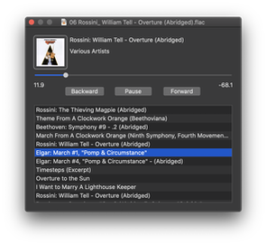
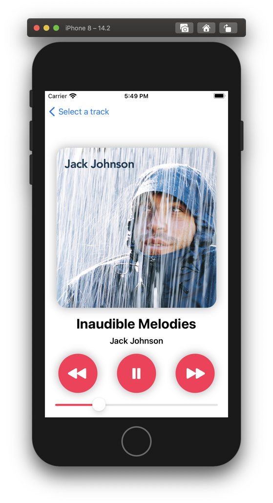

# SFBAudioEngine

SFBAudioEngine is a set of Objective-C and Objective-C++ classes enabling macOS (10.15+) and iOS (13.0+) applications to easily play audio. SFBAudioEngine supports the following formats:

* WAVE
* AIFF
* Apple Lossless
* AAC
* FLAC
* MP3
* WavPack
* Ogg Vorbis
* Ogg Speex
* Ogg Opus
* Musepack
* Monkey's Audio
* True Audio
* All formats supported by libsndfile
* All formats supported by Core Audio
* DSD to PCM conversion for DSD64

In addition to playback, SFBAudioEngine supports reading and writing of metadata for most supported formats.

## Building SFBAudioEngine

1. Clone the [SFBAudioEngine](https://github.com/sbooth/SFBAudioEngine) repository.
2. Download the [dependencies](https://files.sbooth.org/SFBAudioEngine-dependencies.tar.bz2) and decompress in the project's root
3. Open the project, build, and play something using SimplePlayer!

## Quick Start

Playing an audio file is as simple as:

~~~swift
import SFBAudioEngine
let player = AudioPlayer()
let url = URL(fileURLWithPath: "example.flac")
try? player.play(url)
~~~

Reading audio properties and metadata is similarly trivial:

~~~swift
if let audioFile = try? AudioFile(readingPropertiesAndMetadataFrom: url) {
    let sampleRate = audioFile.properties.sampleRate
    let title = audioFile.metadata.title
}
~~~

## Design

### [Audio Decoders](Decoders/)

Audio decoders in SFBAudioEngine are broadly divided into two categories, those producing PCM output and those producing DSD output. Audio decoders read data from an [`SFBInputSource`](Input/SFBInputSource.h) which may refer to a file, buffer, or network source.

All audio decoders in SFBAudioEngine implement the [SFBAudioDecoding](Decoders/SFBAudioDecoding.h) protocol. PCM decoders additionally implement [SFBPCMDecoding](Decoders/SFBPCMDecoding.h) while DSD decoders implement [SFBDSDDecoding](Decoders/SFBDSDDecoding.h). Three special decoder subclasses that wrap an underlying audio decoder are also provided: [SFBLoopableRegionDecoder](Decoders/SFBLoopableRegionDecoder.h), [SFBDoPDecoder](Decoders/SFBDoPDecoder.h), and [SFBDSDPCMDecoder](Decoders/SFBDSDPCMDecoder.h). For seekable inputs, [SFBLoopableRegionDecoder](Decoders/SFBLoopableRegionDecoder.h) allows arbitrary looping and repeating of a specified PCM decoder segment. [SFBDoPDecoder](Decoders/SFBDoPDecoder.h) and [SFBDSDPCMDecoder](Decoders/SFBDSDPCMDecoder.h) wrap a DSD decoder providing DSD over PCM (DoP) and PCM output respectively.

### [SFBAudioPlayerNode](Player/SFBAudioPlayerNode.h)

[SFBAudioPlayerNode](Player/SFBAudioPlayerNode.h) is a subclass of [AVAudioSourceNode](https://developer.apple.com/documentation/avfoundation/avaudiosourcenode) that provides rich playback functionality within an [AVAudioEngine](https://developer.apple.com/documentation/avfoundation/avaudioengine) processing graph. [SFBAudioPlayerNode](Player/SFBAudioPlayerNode.h) supports gapless playback and rich status notifications through delegate callbacks.

### [SFBAudioPlayer](Player/SFBAudioPlayer.h)

[SFBAudioPlayer](Player/SFBAudioPlayer.h) wraps an `AVAudioEngine` processing graph driven by [SFBAudioPlayerNode](Player/SFBAudioPlayerNode.h). [SFBAudioPlayer](Player/SFBAudioPlayer.h) provides complete player functionality with no required configuration but also allows customization of the underlying processing graph as well as rich status notifications through delegate callbacks.

### [Audio Properties and Metadata](Metadata/)

Audio properties and metadata are accessed from instances of [SFBAudioFile](Metadata/SFBAudioFile.h). [Audio properties](Metadata/SFBAudioProperties.h) are read-only while [metadata](Metadata/AudioMetada.h) is writable for most formats.

## Sample Audio Players

Two versions of SimplePlayer, one for macOS and one for iOS, are provided illustrate the usage of SFBAudioEngine.

### macOS

[SimplePlayer](SimplePlayer/) for macOS is written in Swift using AppKit and supports gapless sequential playback of items from a playlist. The essential functionality is contained in one file, [PlayerWindowController.swift](SimplePlayer/PlayerWindowController.swift).

### iOS

[SimplePlayer](SimplePlayer-iOS/) for iOS is written in Swift using SwiftUI and supports playback of a single item selected from a list.

## License

SFBAudioEngine is released under the [MIT License](https://github.com/sbooth/SFBAudioEngine/blob/master/LICENSE.txt).
