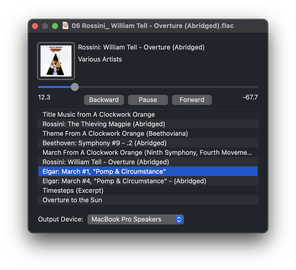
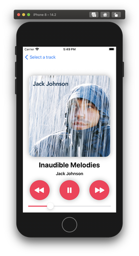

# SFBAudioEngine

SFBAudioEngine is a toolbox of powerful audio functionality for both macOS and iOS. SFBAudioEngine supports:

* [Audio decoding](#decoding)
* [Audio playback](#playback)
* [Audio encoding](#encoding)
* [Audio format conversion](#conversion)
* [Audio properties information and metadata editing](#properties-and-metadata)

SFBAudioEngine is usable from both Swift and Objective-C.

## Format Support

SFBAudioEngine supports most audio formats. In addition to all formats supported by [Core Audio](https://developer.apple.com/library/archive/documentation/MusicAudio/Conceptual/CoreAudioOverview/Introduction/Introduction.html) SFBAudioEngine supports:

* [Ogg Speex](https://www.speex.org)
* [Ogg Vorbis](https://xiph.org/vorbis/)
* [Monkey's Audio](https://www.monkeysaudio.com)
* [Musepack](https://www.musepack.net)
* Shorten
* True Audio
* [WavPack](http://www.wavpack.com)
* All formats supported by [libsndfile](http://libsndfile.github.io/libsndfile/)
* DSD to PCM conversion for DSD64
* DSD decoding for DSF and DSDIFF with support for DSD over PCM (DoP)

[FLAC](https://xiph.org/flac/), [Ogg Opus](https://opus-codec.org), and MP3 are natively supported by Core Audio, however SFBAudioEngine provides its own encoders and decoders for these formats.

## Quick Start

Playing an audio file is as simple as:

~~~swift
import SFBAudioEngine
let player = AudioPlayer()
let url = URL(fileURLWithPath: "example.flac")
try? player.play(url)
~~~

Reading audio properties and metadata is similarly trivial:

~~~swift
if let audioFile = try? AudioFile(readingPropertiesAndMetadataFrom: url) {
    let sampleRate = audioFile.properties.sampleRate
    let title = audioFile.metadata.title
}
~~~

Want to convert a WAVE file to FLAC?

~~~swift
let inputURL = URL(fileURLWithPath: "music.wav")
let outputURL = URL(fileURLWithPath: "music.flac")
try AudioConverter.convert(inputURL, to: outputURL)
~~~

The output file's format is inferred from the file extension.

More complex conversions are supported including writing to `Data` instead of files:

~~~swift
let output = OutputSource.makeForData()
let encoder = try AudioEncoder(outputSource: output, encoderName: .coreAudio)
encoder.settings = [
    .coreAudioFileTypeID: kAudioFileM4AType,
    .coreAudioFormatID: kAudioFormatMPEG4AAC,
    .coreAudioAudioConverterPropertySettings: [kAudioConverterCodecQuality: kAudioConverterQuality_High]
]
try AudioConverter.convert(inputURL, using: encoder)
// Encoder output is in `output.data`
~~~

## Requirements

macOS 10.15+ or iOS 14.0+

## Building SFBAudioEngine

1. `git clone git@github.com:sbooth/SFBAudioEngine.git --recurse-submodules`
2. `cd SFBAudioEngine`
3. `make -C XCFrameworks install`

The project file contains targets for macOS and iOS frameworks. The frameworks are signed to run locally by default. If you are using the hardened runtime you will need to select a team for signing.

The included `Makefile` may also be used to create the build products:

| Target | `make` Command |
| --- | --- |
| macOS Framework | `make archive/macOS.xcarchive` |
| macOS Catalyst Framework | `make archive/macOS-Catalyst.xcarchive` |
| iOS Framework | `make archive/iOS.xcarchive` |
| iOS Simulator Framework | `make archive/iOS-Simulator.xcarchive` |
| XCFramework | `make` |

### SimplePlayer

Open [SimplePlayer](SimplePlayer-macOS/), build, and play something!

## Decoding

[Audio decoders](Decoders/) in SFBAudioEngine are broadly divided into two categories, those producing PCM output and those producing DSD output. Audio decoders read data from an [SFBInputSource](Input/SFBInputSource.h) which may refer to a file, buffer, or network source.

All audio decoders in SFBAudioEngine implement the [SFBAudioDecoding](Decoders/SFBAudioDecoding.h) protocol. PCM-producing decoders additionally implement [SFBPCMDecoding](Decoders/SFBPCMDecoding.h) while DSD decoders implement [SFBDSDDecoding](Decoders/SFBDSDDecoding.h).

Three special decoder subclasses that wrap an underlying audio decoder instance are also provided: [SFBLoopableRegionDecoder](Decoders/SFBLoopableRegionDecoder.h), [SFBDoPDecoder](Decoders/SFBDoPDecoder.h), and [SFBDSDPCMDecoder](Decoders/SFBDSDPCMDecoder.h). For seekable inputs, [SFBLoopableRegionDecoder](Decoders/SFBLoopableRegionDecoder.h) allows arbitrary looping and repeating of a specified PCM decoder segment. [SFBDoPDecoder](Decoders/SFBDoPDecoder.h) and [SFBDSDPCMDecoder](Decoders/SFBDSDPCMDecoder.h) wrap a DSD decoder providing DSD over PCM (DoP) and PCM output respectively.

## Playback

### [SFBAudioPlayerNode](Player/SFBAudioPlayerNode.h)

[SFBAudioPlayerNode](Player/SFBAudioPlayerNode.h) is a subclass of [AVAudioSourceNode](https://developer.apple.com/documentation/avfoundation/avaudiosourcenode) that provides rich playback functionality within an [AVAudioEngine](https://developer.apple.com/documentation/avfoundation/avaudioengine) processing graph. [SFBAudioPlayerNode](Player/SFBAudioPlayerNode.h) supports gapless playback and comprehensive status notifications through delegate callbacks.

### [SFBAudioPlayer](Player/SFBAudioPlayer.h)

[SFBAudioPlayer](Player/SFBAudioPlayer.h) wraps an [AVAudioEngine](https://developer.apple.com/documentation/avfoundation/avaudioengine) processing graph driven by [SFBAudioPlayerNode](Player/SFBAudioPlayerNode.h). [SFBAudioPlayer](Player/SFBAudioPlayer.h) provides complete player functionality with no required configuration but also allows customization of the underlying processing graph as well as rich status notifications through delegate callbacks.

## Encoding

[Audio encoders](Encoders/) in SFBAudioEngine process input data and convert it to their output format. Audio encoders write data to an [SFBOutputSource](Output/SFBOutputSource.h) which may refer to a file, buffer, or memory source.

All audio encoders in SFBAudioEngine implement the [SFBAudioEncoding](Encoders/SFBAudioEncoding.h) protocol. PCM-consuming encoders additionally implement [SFBPCMEncoding](Encoders/SFBPCMEncoding.h). Currently there are no encoders consuming DSD in SFBAudioEngine.

Encoders don't support arbitrary input formats. The processing format used by an encoder is derived from a desired format combined with the encoder's settings.

## Conversion

[SFBAudioConverter](Conversion/SFBAudioConverter.h) supports high level conversion operations. An audio converter pulls input data from a decoder, converts the data to the encoder's processing format, and pushes the data to the encoder. At the completion of conversion metadata is written, if supported.

## Properties and Metadata

Audio properties and metadata are accessed via instances of [SFBAudioFile](Metadata/SFBAudioFile.h). [Audio properties](Metadata/SFBAudioProperties.h) are read-only while [metadata](Metadata/SFBAudioMetadata.h) is writable for most formats. Audio metadata may be obtained from an instance of [SFBAudioFile](Metadata/SFBAudioFile.h) or instantiated directly. 

## Sample Audio Players

Two versions of SimplePlayer, one for macOS and one for iOS, are provided to illustrate the usage of SFBAudioEngine.

### macOS

[SimplePlayer](SimplePlayer-macOS/) for macOS is written in Swift using AppKit and supports gapless sequential playback of items from a playlist. The essential functionality is contained in one file, [PlayerWindowController.swift](SimplePlayer-macOS/PlayerWindowController.swift).

### iOS

[SimplePlayer](SimplePlayer-iOS/) for iOS is written in Swift using SwiftUI and supports playback of a single item selected from a list.

## License

SFBAudioEngine is released under the [MIT License](https://github.com/sbooth/SFBAudioEngine/blob/master/LICENSE.txt).

The open-source projects providing support for the various audio formats are subject to their own licenses that are compatible with the MIT license when used with SFBAudioEngine's default build configuration. For information on the specific licenses for each project see the README in the project's folder in [XCFrameworks](https://github.com/sbooth/AudioXCFrameworks/).

### LGPL Notes

In order to maintain compatibility with the LGPL used by [libsndfile](http://libsndfile.github.io/libsndfile/), [mpg123](https://www.mpg123.de), [libtta-cpp](https://sourceforge.net/projects/tta/), [lame](https://lame.sourceforge.io), and the Musepack encoder dynamic linking is required.
